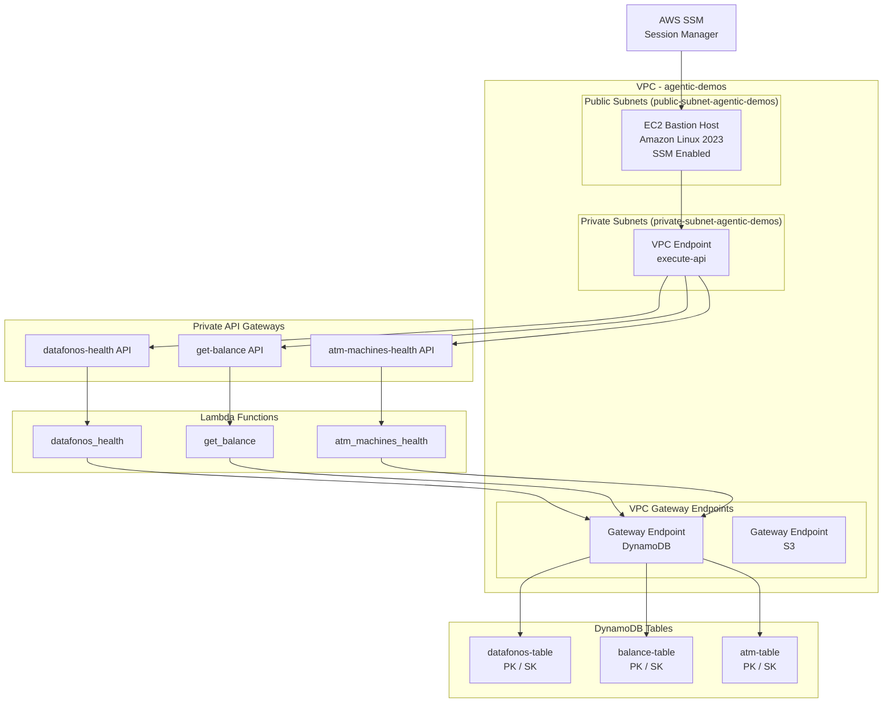
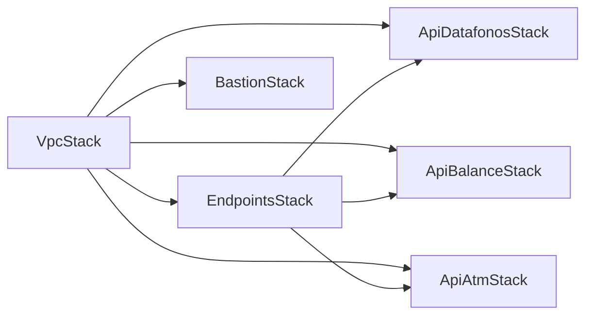

# Design Document: Agentic Demos Infrastructure

## Overview

Este proyecto implementa una infraestructura AWS completa usando CDK Python para soportar demos de agentes inteligentes. La arquitectura consiste en APIs privadas (accesibles solo desde la VPC) respaldadas por Lambda functions y DynamoDB, con un bastion host EC2 como punto de acceso vía SSM. Se utilizan múltiples stacks CDK independientes para mantener separación de responsabilidades y facilitar despliegues incrementales.

La gestión de dependencias se realiza con Python Poetry (virtualenv `.venv`) y el proyecto se organiza en carpetas `infrastructure/`, `lambdas/` y `setup/`.

## Architecture

### Diagrama de Arquitectura



### Stack Dependency Graph



### Decisiones de Diseño

1. **Stacks independientes**: Cada componente es un stack CDK separado para permitir despliegues independientes y reducir blast radius.
2. **APIs privadas con resource policy**: Cada API Gateway tiene una resource policy que restringe acceso exclusivamente al VPC Endpoint de execute-api.
3. **OpenAPI-first**: Las APIs se definen mediante esquemas OpenAPI, lo que permite documentación y validación automática.
4. **Single Table Design en DynamoDB**: Cada API tiene su propia tabla con PK y SK genéricos para flexibilidad de acceso.
5. **SSM en lugar de SSH**: El bastion host usa SSM Session Manager, eliminando la necesidad de gestionar llaves SSH y security groups de SSH.

## Components and Interfaces

### CDK App Entry Point (`infrastructure/app.py`)

Punto de entrada de la aplicación CDK. Instancia todos los stacks y gestiona las dependencias entre ellos.

```python
# Pseudocode
app = cdk.App()
vpc_stack = VpcStack(app, "VpcStack")
endpoints_stack = EndpointsStack(app, "EndpointsStack", vpc=vpc_stack.vpc)
bastion_stack = BastionStack(app, "BastionStack", vpc=vpc_stack.vpc)
api_datafonos_stack = ApiDatafonosStack(app, "ApiDatafonosStack", vpc=vpc_stack.vpc, vpce_id=endpoints_stack.api_vpce_id)
api_balance_stack = ApiBalanceStack(app, "ApiBalanceStack", vpc=vpc_stack.vpc, vpce_id=endpoints_stack.api_vpce_id)
api_atm_stack = ApiAtmStack(app, "ApiAtmStack", vpc=vpc_stack.vpc, vpce_id=endpoints_stack.api_vpce_id)
app.synth()
```

### VpcStack (`infrastructure/stacks/vpc_stack.py`)

- Crea VPC con 2 AZs
- Subnet pública: `public-subnet-agentic-demos`
- Subnet privada: `private-subnet-agentic-demos`
- Expone: `self.vpc`

### EndpointsStack (`infrastructure/stacks/endpoints_stack.py`)

- Recibe: `vpc` del VpcStack
- Crea Gateway Endpoint para DynamoDB
- Crea Gateway Endpoint para S3
- Crea Interface Endpoint para execute-api en subnets privadas con private DNS habilitado
- Expone: `self.api_vpce_id` (ID del VPC Endpoint de execute-api)

### BastionStack (`infrastructure/stacks/bastion_stack.py`)

- Recibe: `vpc` del VpcStack
- Crea instancia EC2 Amazon Linux 2023 en subnet pública
- Configura IAM role con `AmazonSSMManagedInstanceCore`
- Security group permite tráfico saliente a la VPC

### API Stacks (patrón común para los 3 APIs)

Cada API stack (`api_datafonos_stack.py`, `api_balance_stack.py`, `api_atm_stack.py`) sigue el mismo patrón:

- Recibe: `vpc`, `vpce_id`
- Crea tabla DynamoDB (PK: `string`, SK: `string`, PAY_PER_REQUEST)
- Crea Lambda function (Python runtime, código desde `lambdas/<nombre>/`)
- Otorga permisos de lectura de DynamoDB a la Lambda
- Crea API Gateway REST API desde OpenAPI schema
- Configura resource policy para restringir acceso al VPC Endpoint
- Integra Lambda como backend del API

### Lambda Functions

Cada Lambda function sigue el mismo patrón:

```python
# lambdas/<nombre>/index.py
import json
import boto3
import os

def handler(event, context):
    table_name = os.environ["TABLE_NAME"]
    dynamodb = boto3.resource("dynamodb")
    table = dynamodb.Table(table_name)
    # Query/Scan logic specific to each API
    # Return API Gateway compatible response
```

**datafonos_health** (`lambdas/datafonos_health/index.py`):

- Consulta datáfonos por ciudad o lista todos
- Retorna estado de salud de los dispositivos

**get_balance** (`lambdas/get_balance/index.py`):

- Consulta saldo por usuario (PK = USER#username)
- Retorna información de cuenta y saldo

**atm_machines_health** (`lambdas/atm_machines_health/index.py`):

- Consulta cajeros por ciudad o lista todos
- Retorna estado de salud de los ATMs

### OpenAPI Schemas (`infrastructure/openapi/`)

Tres archivos JSON de OpenAPI 3.0:

- `datafonos-health-api.json`: GET /datafonos, GET /datafonos/{city}
- `get-balance-api.json`: GET /balance/{username}
- `atm-machines-health-api.json`: GET /atms, GET /atms/{city}

Cada schema incluye la integración `x-amazon-apigateway-integration` apuntando a la Lambda correspondiente.

### Setup Scripts (`setup/`)

- `populate_datafonos.py`: Genera 100 datáfonos con datos realistas (coordenadas en Medellín/Bogotá, dirección, estado, ID de dispositivo)
- `populate_atms.py`: Genera 25 ATMs con datos realistas (coordenadas en Medellín/Bogotá, dirección, estado, ID)
- `populate_balances.py`: Genera cuentas para los 11 usuarios con saldo, tipo de cuenta y moneda (COP)

## Data Models

### DynamoDB Table: Datáfonos

| Attribute        | Type   | Description                         |
| ---------------- | ------ | ----------------------------------- |
| PK               | String | `CITY#<city_name>`                  |
| SK               | String | `DATAFONO#<device_id>`              |
| device_id        | String | Identificador único del datáfono    |
| merchant_name    | String | Nombre del comercio                 |
| address          | String | Dirección del comercio              |
| latitude         | Number | Coordenada de latitud               |
| longitude        | Number | Coordenada de longitud              |
| status           | String | `active`, `inactive`, `maintenance` |
| last_transaction | String | Timestamp de última transacción     |
| city             | String | `medellin` o `bogota`               |

### DynamoDB Table: Balances

| Attribute    | Type   | Description                       |
| ------------ | ------ | --------------------------------- |
| PK           | String | `USER#<username>`                 |
| SK           | String | `ACCOUNT#<account_type>`          |
| username     | String | Nombre del usuario                |
| account_type | String | `savings`, `checking`             |
| balance      | Number | Saldo de la cuenta en COP         |
| currency     | String | `COP`                             |
| last_updated | String | Timestamp de última actualización |

### DynamoDB Table: ATM Machines

| Attribute    | Type   | Description                                    |
| ------------ | ------ | ---------------------------------------------- |
| PK           | String | `CITY#<city_name>`                             |
| SK           | String | `ATM#<atm_id>`                                 |
| atm_id       | String | Identificador único del cajero                 |
| address      | String | Dirección del cajero                           |
| latitude     | Number | Coordenada de latitud                          |
| longitude    | Number | Coordenada de longitud                         |
| status       | String | `online`, `offline`, `low_cash`, `maintenance` |
| cash_level   | String | `high`, `medium`, `low`, `empty`               |
| last_service | String | Timestamp de último servicio                   |
| city         | String | `medellin` o `bogota`                          |

## Correctness Properties

_A property is a characteristic or behavior that should hold true across all valid executions of a system — essentially, a formal statement about what the system should do. Properties serve as the bridge between human-readable specifications and machine-verifiable correctness guarantees._

Dado que este es un proyecto de infraestructura CDK, la mayoría de los requisitos son verificaciones específicas de configuración (examples) sobre templates CloudFormation sintetizados. Sin embargo, los scripts de generación de datos tienen propiedades universales verificables.

### Property 1: Generated location items have valid cities

_For any_ generated datafono or ATM item produced by the setup scripts, the city attribute must be one of {"medellin", "bogota"}.

**Validates: Requirements 7.1, 7.2**

### Property 2: Generated items contain all required attributes

_For any_ generated data item (datafono, ATM, or balance), all required attributes for its type must be present and non-empty. For datafonos/ATMs: device_id/atm_id, address, latitude, longitude, status, city. For balances: username, account_type, balance, currency.

**Validates: Requirements 7.4, 7.5**

### Property 3: Generated datafono count is exactly 100

_For any_ execution of the datafonos population script, the total number of generated items must equal exactly 100.

**Validates: Requirements 7.1**

### Property 4: Generated ATM count is exactly 25

_For any_ execution of the ATM population script, the total number of generated items must equal exactly 25.

**Validates: Requirements 7.2**

### Property 5: Geographic coordinates are within valid ranges for Colombian cities

_For any_ generated datafono or ATM item, the latitude must be within the range [4.0, 7.5] and the longitude must be within the range [-76.0, -73.5] (covering Medellín and Bogotá metropolitan areas).

**Validates: Requirements 7.4**

## Error Handling

### CDK Stacks

- Si el VPC Endpoint ID no se pasa correctamente entre stacks, el API Gateway stack debe fallar con un mensaje claro durante la síntesis.
- Si el OpenAPI schema file no existe, el stack debe fallar con un error descriptivo.
- Las Lambda functions deben manejar errores de DynamoDB (tabla no encontrada, permisos insuficientes) retornando HTTP 500 con mensaje de error.

### Lambda Functions

- Cada Lambda function debe retornar respuestas con formato API Gateway compatible:
  - `statusCode`: 200 para éxito, 404 para recurso no encontrado, 500 para errores internos
  - `body`: JSON string con datos o mensaje de error
  - `headers`: Incluir `Content-Type: application/json` y headers CORS si aplica
- Los errores de DynamoDB deben ser capturados y logueados antes de retornar respuesta de error.
- Path parameters inválidos deben retornar 400 Bad Request.

### Setup Scripts

- Los scripts deben manejar errores de conexión a DynamoDB con reintentos.
- Si la tabla no existe, el script debe mostrar un mensaje claro indicando que se debe desplegar la infraestructura primero.
- Los scripts deben usar batch_write_item para eficiencia y manejar unprocessed items.

## Testing Strategy

### Nota sobre Testing

El usuario ha indicado explícitamente que **no se incluyen unit tests** en este proyecto. La verificación se realizará mediante:

1. **CDK Synth**: Verificar que los stacks sintetizan correctamente sin errores.
2. **Despliegue y pruebas manuales**: Verificar funcionalidad desplegando y probando desde el bastion host.
3. **Validación de datos**: Los setup scripts incluyen logging para verificar que los datos se generaron correctamente.

### Verificación de Infraestructura

- `cdk synth` para validar que todos los stacks generan templates CloudFormation válidos
- `cdk diff` para revisar cambios antes de desplegar
- `cdk deploy --all` para desplegar todos los stacks en orden de dependencia

### Verificación de APIs

Desde el bastion host vía SSM:

```bash
# Test datafonos API
curl https://<api-id>.execute-api.<region>.amazonaws.com/prod/datafonos

# Test balance API
curl https://<api-id>.execute-api.<region>.amazonaws.com/prod/balance/santi

# Test ATM API
curl https://<api-id>.execute-api.<region>.amazonaws.com/prod/atms
```
