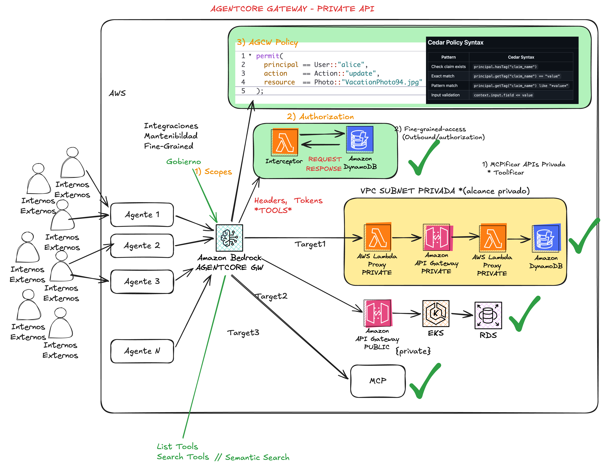
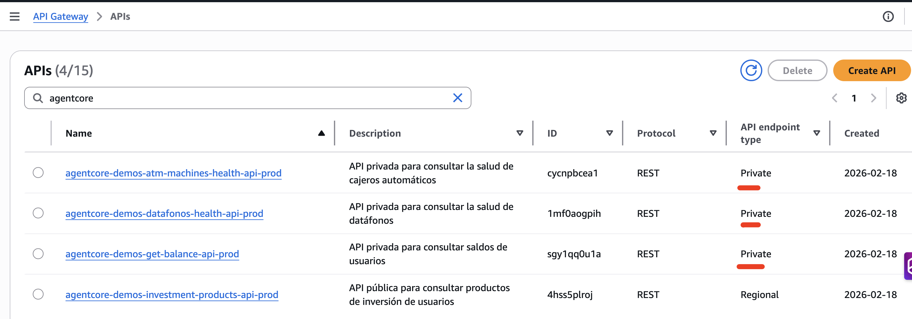
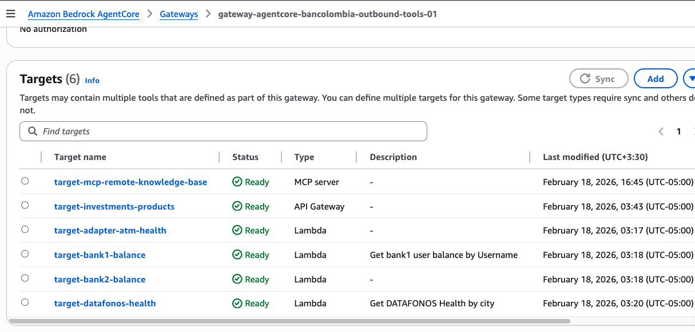
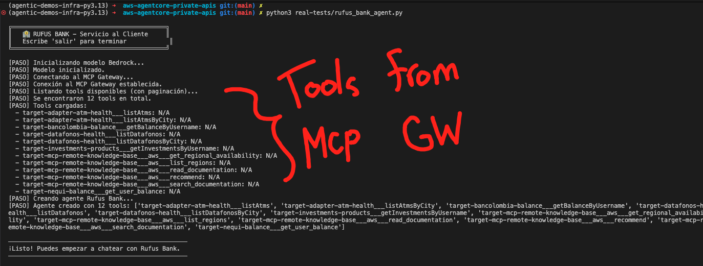
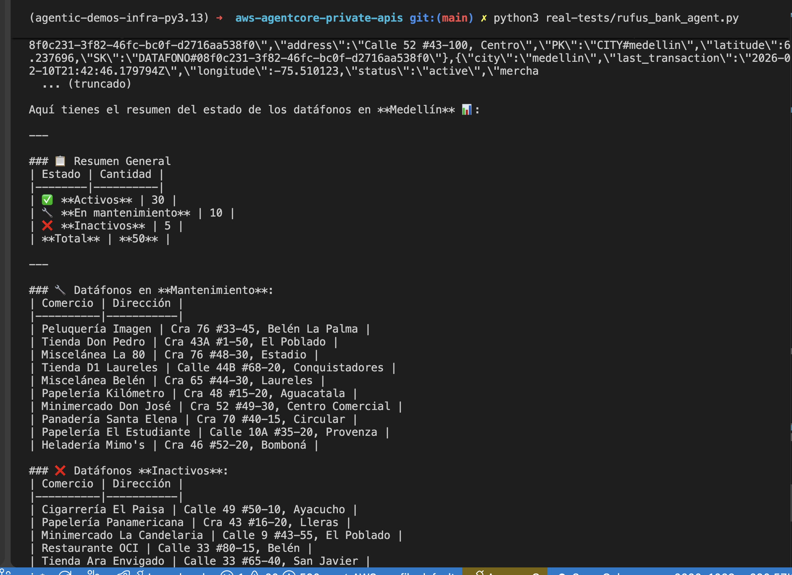

# 🏦 AgentCore Demos Infrastructure

Infraestructura AWS CDK en Python para desplegar un entorno de demos de agentes inteligentes. El sistema consiste en **3 APIs privadas** + **1 API pública** respaldadas por funciones Lambda y tablas DynamoDB, **3 Lambda adapters** para AgentCore Gateway, accesibles desde una VPC a través de un bastion host EC2 con AWS SSM.

## 🖼️ Arquitectura y Targets

### Arquitectura General - AgentCore Gateway + MCP + AWS



### Targets Configurados









---

## 📐 Arquitectura Detallada

```
┌─────────────────────────────────────────────────────────────────────────┐
│                            VPC (2 AZs)                                  │
│                                                                         │
│  ┌──────────────────────┐    ┌────────────────────────────────────────┐ │
│  │   Public Subnets      │    │         Private Subnets                │ │
│  │                        │    │                                        │ │
│  │  ┌──────────────────┐ │    │  ┌──────────────────────────────────┐ │ │
│  │  │  EC2 Bastion Host │ │    │  │  VPC Endpoint (execute-api)      │ │ │
│  │  │  Amazon Linux 2023│ │    │  └──────────────────────────────────┘ │ │
│  │  │  SSM Enabled      │ │    │                                        │ │
│  │  └──────────────────┘ │    │  ┌──────────────────────────────────┐ │ │
│  └──────────────────────┘    │  │  Lambda Adapters (x3)             │ │ │
│                               │  │  → Proxy to Private APIs          │ │ │
│  ┌──────────────────────────┐│  │  (AgentCore Gateway targets)      │ │ │
│  │  VPC Gateway Endpoints   ││  └──────────────────────────────────┘ │ │
│  │  • DynamoDB    • S3      ││                                        │ │
│  └──────────────────────────┘└────────────────────────────────────────┘ │
└─────────────────────────────────────────────────────────────────────────┘
         │                                          │
         │  SSM Session Manager                     │  AgentCore Gateway
         ▼                                          ▼
┌─────────────────────────────────────────────────────────────────────────┐
│                      Private API Gateways (VPC Only)                    │
│                                                                         │
│  ┌───────────────────┐ ┌──────────────────┐ ┌────────────────────────┐ │
│  │ Datafonos Health   │ │ Get Balance      │ │ ATM Machines Health    │ │
│  │ GET /datafonos     │ │ GET /balance/    │ │ GET /atms              │ │
│  │ GET /datafonos/    │ │     {username}   │ │ GET /atms/{city}       │ │
│  │     {city}         │ │                  │ │                        │ │
│  └────────┬──────────┘ └────────┬─────────┘ └────────┬───────────────┘ │
│           ▼                     ▼                     ▼                 │
│     Lambda + DynamoDB     Lambda + DynamoDB     Lambda + DynamoDB       │
└─────────────────────────────────────────────────────────────────────────┘

┌─────────────────────────────────────────────────────────────────────────┐
│                   Public API Gateway (API Key Required)                  │
│                                                                         │
│  ┌──────────────────────────────────────────────────────────────────┐   │
│  │ Investment Products API                                          │   │
│  │ GET /investments/{username}    🔑 x-api-key header required      │   │
│  └──────────────────────┬───────────────────────────────────────────┘   │
│                         ▼                                               │
│                   Lambda + DynamoDB                                      │
└─────────────────────────────────────────────────────────────────────────┘
```

## 📁 Estructura del Proyecto

```
.
├── cdk.json                          # Configuración CDK + appconfig
├── pyproject.toml                    # Dependencias Python (Poetry)
├── poetry.toml                       # Configuración virtualenv (.venv)
├── README.md
│
├── infrastructure/
│   ├── __init__.py
│   ├── app.py                        # Entry point CDK - instancia todos los stacks
│   ├── openapi/
│   │   ├── datafonos-health-api.json          # OpenAPI - Datafonos API (Private)
│   │   ├── get-balance-api.json               # OpenAPI - Balance API (Private)
│   │   ├── atm-machines-health-api.json       # OpenAPI - ATM API (Private)
│   │   ├── investment-products-api.json       # OpenAPI - Investments API (Public + API Key)
│   │   ├── agentcore-tool-schema-datafonos.json   # MCP Tool Schema - Datafonos
│   │   ├── agentcore-tool-schema-balance.json     # MCP Tool Schema - Balance
│   │   ├── agentcore-tool-schema-atm.json         # MCP Tool Schema - ATM
│   │   └── agentcore-tool-schema-investments.json # MCP Tool Schema - Investments
│   └── stacks/
│       ├── __init__.py
│       ├── vpc_stack.py                       # VPC con subnets públicas y privadas
│       ├── endpoints_stack.py                 # VPC Endpoints (DynamoDB, S3, execute-api)
│       ├── bastion_stack.py                   # EC2 Bastion Host con SSM
│       ├── api_datafonos_stack.py             # Private API + Lambda + DynamoDB (Datáfonos)
│       ├── api_balance_stack.py               # Private API + Lambda + DynamoDB (Balances)
│       ├── api_atm_stack.py                   # Private API + Lambda + DynamoDB (ATMs)
│       ├── api_investments_stack.py           # Public API + Lambda + DynamoDB (Investments)
│       └── agentcore_gateway_adapters_stack.py # Lambda adapters for AgentCore Gateway
│
├── lambdas/
│   ├── datafonos_health/
│   │   └── index.py                  # Handler: GET /datafonos, GET /datafonos/{city}
│   ├── get_balance/
│   │   └── index.py                  # Handler: GET /balance/{username}
│   ├── atm_machines_health/
│   │   └── index.py                  # Handler: GET /atms, GET /atms/{city}
│   ├── investment_products/
│   │   └── index.py                  # Handler: GET /investments/{username}
│   ├── adapter_datafonos/
│   │   └── index.py                  # Proxy adapter: Datafonos Private API
│   ├── adapter_balance/
│   │   └── index.py                  # Proxy adapter: Balance Private API
│   └── adapter_atm/
│       └── index.py                  # Proxy adapter: ATM Private API
│
├── setup/
│   ├── populate_datafonos.py         # Genera 100 datáfonos simulados
│   ├── populate_atms.py              # Genera 25 ATMs simulados
│   ├── populate_balances.py          # Genera cuentas para 11 usuarios
│   └── populate_investments.py       # Genera inversiones para 11 usuarios
│
└── real-tests/
    ├── rufus_bank_agent.py           # Agente interactivo Rufus Bank (Strands + MCP)
    └── 00_invoke_mcp_tools_no_auth.py # Test de MCP tools
```

---

## 🚀 Requisitos Previos

- **Python** >= 3.9
- **Poetry** (gestor de dependencias Python)
- **AWS CDK CLI** (`npm install -g aws-cdk`)
- **AWS CLI** configurado con credenciales válidas
- **Node.js** >= 20.x (requerido por CDK CLI)

## ⚡ Inicio Rápido

### 1. Instalar dependencias

```bash
poetry install
```

### 2. Sintetizar los stacks (verificar que todo compila)

```bash
poetry run cdk synth
```

### 3. Desplegar toda la infraestructura

```bash
poetry run cdk deploy --all
```

### 4. Poblar las tablas DynamoDB con datos simulados

```bash
# Obtener los nombres de las tablas del output de CDK o de la consola AWS
python setup/populate_datafonos.py <DATAFONOS_TABLE_NAME>
python setup/populate_atms.py <ATM_TABLE_NAME>
python setup/populate_balances.py <BALANCE_TABLE_NAME>
```

### 5. Probar las APIs desde el Bastion Host

```bash
# Conectarse al bastion via SSM
aws ssm start-session --target <INSTANCE_ID>

# Probar las APIs
curl https://<api-id>.execute-api.<region>.amazonaws.com/prod/datafonos
curl https://<api-id>.execute-api.<region>.amazonaws.com/prod/balance/santi
curl https://<api-id>.execute-api.<region>.amazonaws.com/prod/atms
```

---

## 🏗️ CDK Stacks en Detalle

### Stack 1: `VpcStack` — Red Base

**Archivo:** `infrastructure/stacks/vpc_stack.py`

Crea la VPC que sirve como fundamento de red para toda la infraestructura.

| Recurso              | Descripción                                                                         |
| -------------------- | ----------------------------------------------------------------------------------- |
| **VPC**              | Red virtual con CIDR automático, nombrada `{prefix}-vpc-{env}`                      |
| **Public Subnets**   | 2 subnets públicas (una por AZ), nombradas `{prefix}-public-subnet-{env}`           |
| **Private Subnets**  | 2 subnets privadas aisladas (una por AZ), nombradas `{prefix}-private-subnet-{env}` |
| **Internet Gateway** | Creado automáticamente para las subnets públicas                                    |

- **AZs:** 2 (alta disponibilidad)
- **Tipo de subnets privadas:** `PRIVATE_ISOLATED` (sin NAT Gateway, sin acceso a internet)
- **Expone:** `self.vpc` para que otros stacks lo referencien

---

### Stack 2: `EndpointsStack` — VPC Endpoints

**Archivo:** `infrastructure/stacks/endpoints_stack.py`

Crea los VPC Endpoints necesarios para que los recursos en subnets privadas accedan a servicios AWS sin salir de la red de Amazon.

| Recurso                  | Tipo      | Servicio                             | Ubicación              |
| ------------------------ | --------- | ------------------------------------ | ---------------------- |
| **DynamoDB Endpoint**    | Gateway   | `com.amazonaws.{region}.dynamodb`    | Route tables de la VPC |
| **S3 Endpoint**          | Gateway   | `com.amazonaws.{region}.s3`          | Route tables de la VPC |
| **Execute-API Endpoint** | Interface | `com.amazonaws.{region}.execute-api` | Private subnets        |

- **Private DNS:** Habilitado en el endpoint de execute-api (permite usar URLs estándar de API Gateway)
- **Recibe:** `vpc` del VpcStack
- **Expone:** `self.api_vpce_id` (ID del VPC Endpoint de execute-api, usado en resource policies de los API Gateways)

---

### Stack 3: `BastionStack` — Host de Acceso

**Archivo:** `infrastructure/stacks/bastion_stack.py`

Crea una instancia EC2 en subnet pública que sirve como punto de acceso a los recursos privados de la VPC.

| Recurso            | Configuración                                                           |
| ------------------ | ----------------------------------------------------------------------- |
| **EC2 Instance**   | Amazon Linux 2023, `t3.micro`, nombrada `{prefix}-bastion-{env}`        |
| **IAM Role**       | `{prefix}-bastion-role-{env}` con policy `AmazonSSMManagedInstanceCore` |
| **Security Group** | `{prefix}-bastion-sg-{env}`, egress solo al CIDR de la VPC              |

- **Acceso:** Exclusivamente vía AWS SSM Session Manager (sin SSH, sin key pairs)
- **Sin acceso a internet:** El security group solo permite tráfico saliente hacia la VPC
- **Recibe:** `vpc` del VpcStack

---

### Stack 4: `ApiDatafonosStack` — API de Salud de Datáfonos

**Archivo:** `infrastructure/stacks/api_datafonos_stack.py`

API privada para consultar el estado de salud de datáfonos (dispositivos de pago) en Medellín y Bogotá.

| Recurso             | Nombre                                | Descripción                                |
| ------------------- | ------------------------------------- | ------------------------------------------ |
| **DynamoDB Table**  | `{prefix}-datafonos-table-{env}`      | PK (string) + SK (string), PAY_PER_REQUEST |
| **Lambda Function** | `{prefix}-datafonos-health-fn-{env}`  | Python 3.12, handler `index.handler`       |
| **API Gateway**     | `{prefix}-datafonos-health-api-{env}` | REST API privada, stage `prod`             |

**Endpoints:**

| Método | Ruta                | Descripción                 | DynamoDB Operation      |
| ------ | ------------------- | --------------------------- | ----------------------- |
| `GET`  | `/datafonos`        | Lista todos los datáfonos   | `scan()`                |
| `GET`  | `/datafonos/{city}` | Filtra datáfonos por ciudad | `query(PK=CITY#{city})` |

**Modelo de datos DynamoDB:**

| Atributo           | Tipo   | Ejemplo                               |
| ------------------ | ------ | ------------------------------------- |
| `PK`               | String | `CITY#medellin`                       |
| `SK`               | String | `DATAFONO#uuid-xxx`                   |
| `device_id`        | String | UUID del dispositivo                  |
| `merchant_name`    | String | `Tienda Don Pedro`                    |
| `address`          | String | `Cra 43A #1-50, El Poblado`           |
| `latitude`         | Number | `6.210345`                            |
| `longitude`        | Number | `-75.567890`                          |
| `status`           | String | `active` / `inactive` / `maintenance` |
| `last_transaction` | String | ISO 8601 timestamp                    |
| `city`             | String | `medellin` / `bogota`                 |

---

### Stack 5: `ApiBalanceStack` — API de Consulta de Saldo

**Archivo:** `infrastructure/stacks/api_balance_stack.py`

API privada para consultar saldos y cuentas de usuarios.

| Recurso             | Nombre                           | Descripción                                |
| ------------------- | -------------------------------- | ------------------------------------------ |
| **DynamoDB Table**  | `{prefix}-balance-table-{env}`   | PK (string) + SK (string), PAY_PER_REQUEST |
| **Lambda Function** | `{prefix}-get-balance-fn-{env}`  | Python 3.12, handler `index.handler`       |
| **API Gateway**     | `{prefix}-get-balance-api-{env}` | REST API privada, stage `prod`             |

**Endpoints:**

| Método | Ruta                  | Descripción                  | DynamoDB Operation          |
| ------ | --------------------- | ---------------------------- | --------------------------- |
| `GET`  | `/balance/{username}` | Consulta cuentas por usuario | `query(PK=USER#{username})` |

**Modelo de datos DynamoDB:**

| Atributo       | Tipo   | Ejemplo                |
| -------------- | ------ | ---------------------- |
| `PK`           | String | `USER#santi`           |
| `SK`           | String | `ACCOUNT#savings`      |
| `username`     | String | `santi`                |
| `account_type` | String | `savings` / `checking` |
| `balance`      | Number | `15000000` (COP)       |
| `currency`     | String | `COP`                  |
| `last_updated` | String | ISO 8601 timestamp     |

---

### Stack 6: `ApiAtmStack` — API de Salud de Cajeros Automáticos

**Archivo:** `infrastructure/stacks/api_atm_stack.py`

API privada para consultar el estado de cajeros automáticos (ATMs) en Medellín y Bogotá.

| Recurso             | Nombre                                   | Descripción                                |
| ------------------- | ---------------------------------------- | ------------------------------------------ |
| **DynamoDB Table**  | `{prefix}-atm-table-{env}`               | PK (string) + SK (string), PAY_PER_REQUEST |
| **Lambda Function** | `{prefix}-atm-machines-health-fn-{env}`  | Python 3.12, handler `index.handler`       |
| **API Gateway**     | `{prefix}-atm-machines-health-api-{env}` | REST API privada, stage `prod`             |

**Endpoints:**

| Método | Ruta           | Descripción            | DynamoDB Operation      |
| ------ | -------------- | ---------------------- | ----------------------- |
| `GET`  | `/atms`        | Lista todos los ATMs   | `scan()`                |
| `GET`  | `/atms/{city}` | Filtra ATMs por ciudad | `query(PK=CITY#{city})` |

**Modelo de datos DynamoDB:**

| Atributo       | Tipo   | Ejemplo                                           |
| -------------- | ------ | ------------------------------------------------- |
| `PK`           | String | `CITY#bogota`                                     |
| `SK`           | String | `ATM#uuid-xxx`                                    |
| `atm_id`       | String | UUID del cajero                                   |
| `address`      | String | `Bancolombia Usaquén - Calle 116 #18-30`          |
| `latitude`     | Number | `4.650123`                                        |
| `longitude`    | Number | `-74.050456`                                      |
| `status`       | String | `online` / `offline` / `low_cash` / `maintenance` |
| `cash_level`   | String | `high` / `medium` / `low` / `empty`               |
| `last_service` | String | ISO 8601 timestamp                                |
| `city`         | String | `medellin` / `bogota`                             |

---

### Stack 7: `ApiInvestmentsStack` — API Pública de Productos de Inversión

**Archivo:** `infrastructure/stacks/api_investments_stack.py`

API pública (REGIONAL) con API Key para consultar productos de inversión de usuarios. A diferencia de las otras APIs, esta es accesible desde internet con autenticación por API Key.

| Recurso             | Nombre                                   | Descripción                                |
| ------------------- | ---------------------------------------- | ------------------------------------------ |
| **DynamoDB Table**  | `{prefix}-investments-table-{env}`       | PK (string) + SK (string), PAY_PER_REQUEST |
| **Lambda Function** | `{prefix}-investment-products-fn-{env}`  | Python 3.12, handler `index.handler`       |
| **API Gateway**     | `{prefix}-investment-products-api-{env}` | REST API pública REGIONAL, stage `prod`    |
| **API Key**         | `{prefix}-investments-api-key-{env}`     | API Key requerida en header `x-api-key`    |
| **Usage Plan**      | `{prefix}-investments-usage-plan-{env}`  | Throttle: 100 req/s, burst 50              |

**Endpoints:**

| Método | Ruta                      | Auth    | Descripción                      | DynamoDB Operation          |
| ------ | ------------------------- | ------- | -------------------------------- | --------------------------- |
| `GET`  | `/investments/{username}` | API Key | Consulta inversiones por usuario | `query(PK=USER#{username})` |

**Modelo de datos DynamoDB:**

| Atributo          | Tipo   | Ejemplo                                                                         |
| ----------------- | ------ | ------------------------------------------------------------------------------- |
| `PK`              | String | `USER#santi`                                                                    |
| `SK`              | String | `INVESTMENT#CDT#abc123`                                                         |
| `username`        | String | `santi`                                                                         |
| `product_type`    | String | `Fiduciaria` / `CDT` / `Crypto` / `Bono` / `TES` / `Cuenta Global` / `Acciones` |
| `product_name`    | String | `CDT 360 días`, `Bitcoin (BTC)`, `Bono Ecopetrol`                               |
| `invested_amount` | Number | `25000000` (COP)                                                                |
| `current_value`   | Number | `27500000` (COP)                                                                |
| `currency`        | String | `COP`                                                                           |
| `return_rate`     | Number | `10.5` (%)                                                                      |
| `start_date`      | String | `2025-06-15`                                                                    |
| `maturity_date`   | String | `2026-06-15` o `N/A`                                                            |
| `status`          | String | `active` / `matured` / `pending`                                                |

---

### Stack 8: `AgentCoreGatewayAdaptersStack` — Lambda Adapters para AgentCore Gateway

**Archivo:** `infrastructure/stacks/agentcore_gateway_adapters_stack.py`

3 Lambda functions desplegadas en las subnets privadas de la VPC que actúan como proxy entre AgentCore Gateway y las Private APIs. Necesarias porque AgentCore Gateway no soporta targets de API privadas directamente.

| Recurso               | Nombre                             | Proxy hacia              |
| --------------------- | ---------------------------------- | ------------------------ |
| **Datafonos Adapter** | `{prefix}-adapter-datafonos-{env}` | Private Datafonos API    |
| **Balance Adapter**   | `{prefix}-adapter-balance-{env}`   | Private Balance API      |
| **ATM Adapter**       | `{prefix}-adapter-atm-{env}`       | Private ATM API          |
| **Security Group**    | `{prefix}-adapter-sg-{env}`        | HTTPS egress al VPC CIDR |

Cada Lambda recibe `API_BASE_URL` como variable de entorno (URL del Private API Gateway correspondiente) y hace HTTP GET al endpoint privado.

---

## ⚙️ Configuración Dinámica (`cdk.json`)

Toda la configuración de nombres de recursos se centraliza en `cdk.json` bajo `context.appconfig`. Esto permite cambiar nombres y ambientes sin tocar código Python.

```json
{
  "context": {
    "appconfig": {
      "resources_name": "agentcore-demos",
      "deployment_environment": "prod",
      "vpc_name": "vpc",
      "public_subnet_name": "public-subnet",
      "private_subnet_name": "private-subnet",
      "bastion_name": "bastion",
      "datafonos_table_name": "datafonos-table",
      "datafonos_lambda_name": "datafonos-health-fn",
      "datafonos_api_name": "datafonos-health-api",
      "balance_table_name": "balance-table",
      "balance_lambda_name": "get-balance-fn",
      "balance_api_name": "get-balance-api",
      "atm_table_name": "atm-table",
      "atm_lambda_name": "atm-machines-health-fn",
      "atm_api_name": "atm-machines-health-api"
    }
  }
}
```

### Convención de Nombres

Todos los recursos AWS siguen el patrón:

```
{resources_name}-{resource_specific_name}-{deployment_environment}
```

**Ejemplo con configuración por defecto (`prod`):**

| Recurso             | Nombre en AWS                                  |
| ------------------- | ---------------------------------------------- |
| VPC                 | `agentcore-demos-vpc-prod`                     |
| Public Subnet       | `agentcore-demos-public-subnet-prod`           |
| Private Subnet      | `agentcore-demos-private-subnet-prod`          |
| Bastion Instance    | `agentcore-demos-bastion-prod`                 |
| Bastion Role        | `agentcore-demos-bastion-role-prod`            |
| Bastion SG          | `agentcore-demos-bastion-sg-prod`              |
| Datafonos Table     | `agentcore-demos-datafonos-table-prod`         |
| Datafonos Lambda    | `agentcore-demos-datafonos-health-fn-prod`     |
| Datafonos API       | `agentcore-demos-datafonos-health-api-prod`    |
| Balance Table       | `agentcore-demos-balance-table-prod`           |
| Balance Lambda      | `agentcore-demos-get-balance-fn-prod`          |
| Balance API         | `agentcore-demos-get-balance-api-prod`         |
| ATM Table           | `agentcore-demos-atm-table-prod`               |
| ATM Lambda          | `agentcore-demos-atm-machines-health-fn-prod`  |
| ATM API             | `agentcore-demos-atm-machines-health-api-prod` |
| Investments Table   | `agentcore-demos-investments-table-prod`       |
| Investments Lambda  | `agentcore-demos-investment-products-fn-prod`  |
| Investments API     | `agentcore-demos-investment-products-api-prod` |
| Investments API Key | `agentcore-demos-investments-api-key-prod`     |
| Adapter Datafonos   | `agentcore-demos-adapter-datafonos-prod`       |
| Adapter Balance     | `agentcore-demos-adapter-balance-prod`         |
| Adapter ATM         | `agentcore-demos-adapter-atm-prod`             |

### Multi-Environment Deployment

Para desplegar en otro ambiente, simplemente cambiá `deployment_environment` en `cdk.json`:

```json
"deployment_environment": "dev"
```

Esto genera recursos con sufijo `-dev` en lugar de `-prod`, permitiendo tener múltiples ambientes en la misma cuenta AWS sin conflictos de nombres.

---

## 🔒 Seguridad

### APIs Privadas (Datafonos, Balance, ATM)

Las 3 APIs son de tipo **PRIVATE** y solo son accesibles desde dentro de la VPC a través del VPC Endpoint de `execute-api`. Cada API tiene una **resource policy** que restringe el acceso exclusivamente al VPC Endpoint:

```json
{
  "Effect": "Allow",
  "Principal": "*",
  "Action": "execute-api:Invoke",
  "Resource": "execute-api:/*",
  "Condition": {
    "StringEquals": {
      "aws:sourceVpce": "<vpce-id>"
    }
  }
}
```

### API Pública (Investment Products)

La API de inversiones es **REGIONAL** (pública) protegida con **API Key**:

- Requiere header `x-api-key` en cada request
- Usage Plan con throttling (100 req/s, burst 50)
- Para obtener el valor del API Key: `aws apigateway get-api-key --api-key <KEY_ID> --include-value`

### Bastion Host

- Acceso únicamente vía **AWS SSM Session Manager** (sin SSH, sin key pairs)
- Security group con egress restringido al CIDR de la VPC
- IAM role con política mínima (`AmazonSSMManagedInstanceCore`)

### Lambda Functions

- Cada Lambda tiene permisos de **solo lectura** (`grant_read_data`) sobre su tabla DynamoDB correspondiente
- Las tablas DynamoDB son accesibles vía **VPC Gateway Endpoint** (tráfico nunca sale de la red AWS)

---

## 📊 Scripts de Población de Datos

Los scripts en `setup/` generan datos simulados realistas para las tablas DynamoDB.

| Script                    | Registros       | Ciudades                   | Uso                                               |
| ------------------------- | --------------- | -------------------------- | ------------------------------------------------- |
| `populate_datafonos.py`   | 100 datáfonos   | Medellín (50), Bogotá (50) | `python setup/populate_datafonos.py TABLE_NAME`   |
| `populate_atms.py`        | 25 ATMs         | Medellín (13), Bogotá (12) | `python setup/populate_atms.py TABLE_NAME`        |
| `populate_balances.py`    | ~20 cuentas     | N/A (11 usuarios)          | `python setup/populate_balances.py TABLE_NAME`    |
| `populate_investments.py` | ~35 inversiones | N/A (11 usuarios)          | `python setup/populate_investments.py TABLE_NAME` |

**Usuarios disponibles:** `santi`, `moni`, `jero`, `joachim`, `fabi`, `chucho`, `herb`, `vale`, `naz`, `javi`, `elkin`

**Productos de inversión:** Fiduciaria, CDT, Crypto, Bono, TES, Cuenta Global, Acciones

Los datos incluyen:

- Direcciones reales de Medellín y Bogotá
- Coordenadas geográficas dentro de los rangos correctos de cada ciudad
- Nombres de comercios y bancos colombianos reales
- Distribución realista de estados (70% activos, 15% inactivos, 15% mantenimiento)

---

## 🔗 Dependencias entre Stacks

```
VpcStack ──────┬──────► EndpointsStack ──────┬──► ApiDatafonosStack ──┐
               │                              ├──► ApiBalanceStack ────┤
               │                              └──► ApiAtmStack ────────┤
               │                                                       │
               ├──────► BastionStack                                   │
               │                                                       ▼
               ├──────► AgentCoreGatewayAdaptersStack ◄── (API URLs from above)
               │
               └──────► (ApiInvestmentsStack is standalone, no VPC needed)
```

- **VpcStack** → Provee `vpc` a todos los stacks de red
- **EndpointsStack** → Provee `api_vpce_id` a los 3 API stacks privados
- **API stacks privados** → Proveen `api_url` al AgentCoreGatewayAdaptersStack
- **ApiInvestmentsStack** → Standalone (API pública, no necesita VPC)

---

## 🧹 Limpieza

Para destruir toda la infraestructura:

```bash
poetry run cdk destroy --all
```

> **Nota:** Las tablas DynamoDB tienen `removal_policy=DESTROY`, por lo que se eliminan automáticamente al destruir los stacks.

---

## 📝 Comandos Útiles

```bash
# Instalar dependencias
poetry install

# Sintetizar CloudFormation templates
poetry run cdk synth

# Ver diferencias antes de desplegar
poetry run cdk diff

# Desplegar todos los stacks
poetry run cdk deploy --all

# Desplegar un stack específico
poetry run cdk deploy VpcStack

# Destruir toda la infraestructura
poetry run cdk destroy --all

# Listar stacks
poetry run cdk list
```
